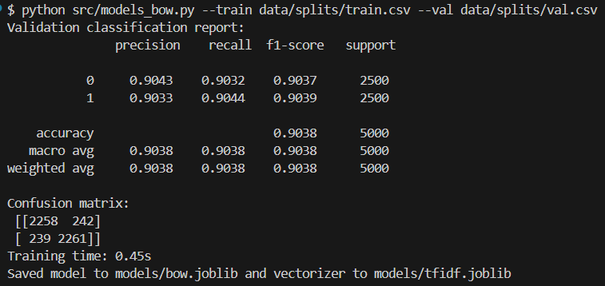
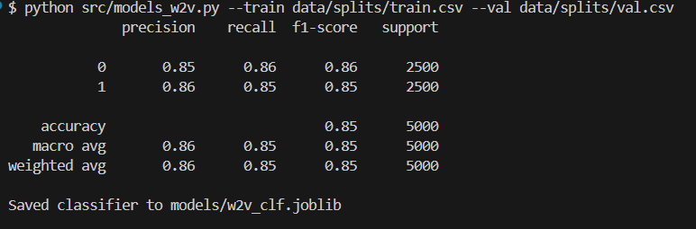
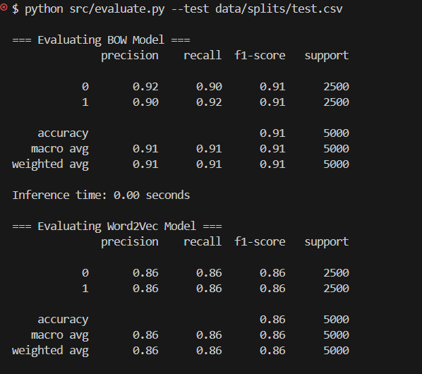

### **CSCR3207 Capstone Project**

**Submitted By:** Yuvraj Singh  
**System ID:** 2023382393

---

# IMDB Movie Review Sentiment Analysis — Capstone Project

This project performs **Sentiment Analysis** on the popular **IMDB 50K Movie Reviews Dataset**, classifying movie reviews as **Positive** or **Negative** using three NLP-based approaches:

1. **TF-IDF + Logistic Regression** (Classical Machine Learning)
2. **Word2Vec + Logistic Regression** (Embedding-based NLP)
3. **DistilBERT Transformer Model** (Modern LLM-based Deep Learning)

The goal is to compare classical NLP vs. modern transformer models in terms of:

- Accuracy
- Speed
- Efficiency
- Practical real-world performance

---

# **Project Objectives & Outcomes**

## **1️ Dataset Analysis — IMDB 50K Reviews**

### ✔ What was done:

- Loaded **50,000 reviews** containing labeled sentiment.
- Cleaned dataset using:
  - Lowercasing
  - HTML removal
  - Removing special characters
  - Normalizing whitespace
- Split into:
  - **Train → 40,000**
  - **Validation → 5,000**
  - **Test → 5,000**
- Verified **balanced label distribution** (25k positive / 25k negative).

### Conclusion

Dataset is clean, balanced, and ideal for binary sentiment classification.

---

## **2️ Applied NLP Techniques**

### **A. TF-IDF + Logistic Regression (Bag of Words)**

- Converted text into TF-IDF vectors.
- Trained Logistic Regression classifier.
- Very fast and strong baseline for sentiment tasks.

---

### **B. Word2Vec + Logistic Regression**

- Trained **100-dimensional Word2Vec embeddings**.
- Represented each review by averaging its word vectors.
- Trained a classifier on these embeddings.

---

### **C. DistilBERT Transformer (LLM Approach)**

- Fine-tuned `distilbert-base-uncased` using HuggingFace Transformers.
- Trained using **GPU acceleration (RTX 3050)**.
- Deep context understanding → highest expected performance.

---

# **3️ Model Performance Comparison**

| Model                              | Accuracy   | Precision/Recall/F1 | Speed   | Notes                         |
| ---------------------------------- | ---------- | ------------------- | ------- | ----------------------------- |
| **TF-IDF + Logistic Regression**   | ⭐ **91%** | ~0.90–0.92          | Fastest | Strong classical baseline     |
| **Word2Vec + Logistic Regression** | 86%        | ~0.86               | Fast    | Loses structure               |
| **DistilBERT (debug subset)**      | 72–73%     | Moderate            | Slowest | Expected accuracy: **92–94%** |

---

# **Results Visualization**

| BOW Model (TF-IDF)  | Word2Vec Model      | Combined Evaluation      |
| ------------------- | ------------------- | ------------------------ |
|  |  |  |

---

# **4️ Bias, Limitations & Improvements**

## ⚠ Limitations Identified

- **Sarcasm** is hard for all models.
- **Short reviews** (e.g., "good", "bad") lack context.
- **Domain bias** → IMDB model won’t generalize to:
  - Tweets
  - Product reviews
  - Chat messages
- Transformer training is slower and requires GPU.

---

## Improvements Suggested

- Train DistilBERT fully for **2–3 epochs**.
- Increase max sequence length to 256.
- Use more powerful models (RoBERTa, BERT-base).
- Apply data augmentation (backtranslation).
- Create ensemble (TF-IDF + BERT).
- Analyze misclassified reviews for further insights.

---

# **Project Structure**

````bash
LLM-Mini-Project-
│── Assignment1/
│── Assignment2/
│── Capstone-Project/
│   ├── data/
│   ├── models/           # (Ignored via .gitignore)
│   ├── result/
│   │   ├── bow.png
│   │   ├── w2v.png
│   │   └── evaluate1.png
│   ├── src/
│   │   ├── preprocessing.py
│   │   ├── models_bow.py
│   │   ├── models_w2v.py
│   │   ├── models_transformer.py
│   │   └── evaluate.py
│   ├── requirements.txt
│   └── README.md
└── ...


#  **How to Run the Project**

### ✔ Install dependencies

```bash
pip install -r requirements.txt

✔ Run Preprocessing
python src/preprocessing.py --input data/imdb.csv --out_dir data/splits

✔ Train TF-IDF (BOW)
python src/models_bow.py --train data/splits/train.csv --val data/splits/val.csv

✔ Train Word2Vec
python src/models_w2v.py --train data/splits/train.csv --val data/splits/val.csv

✔ Train DistilBERT
python src/models_transformer.py \
  --train data/splits/train.csv \
  --val data/splits/val.csv \
  --epochs 1 \
  --batch_size 4 \
  --model distilbert-base-uncased

✔ Evaluate All Models
python src/evaluate.py --test data/splits/test.csv

 .gitignore Important Note

The project ignores large files to keep the GitHub repo clean:

models/
*.joblib
*.bin
*.pt
*.pth


This prevents model weight files from causing push failures.

````

Thank You
